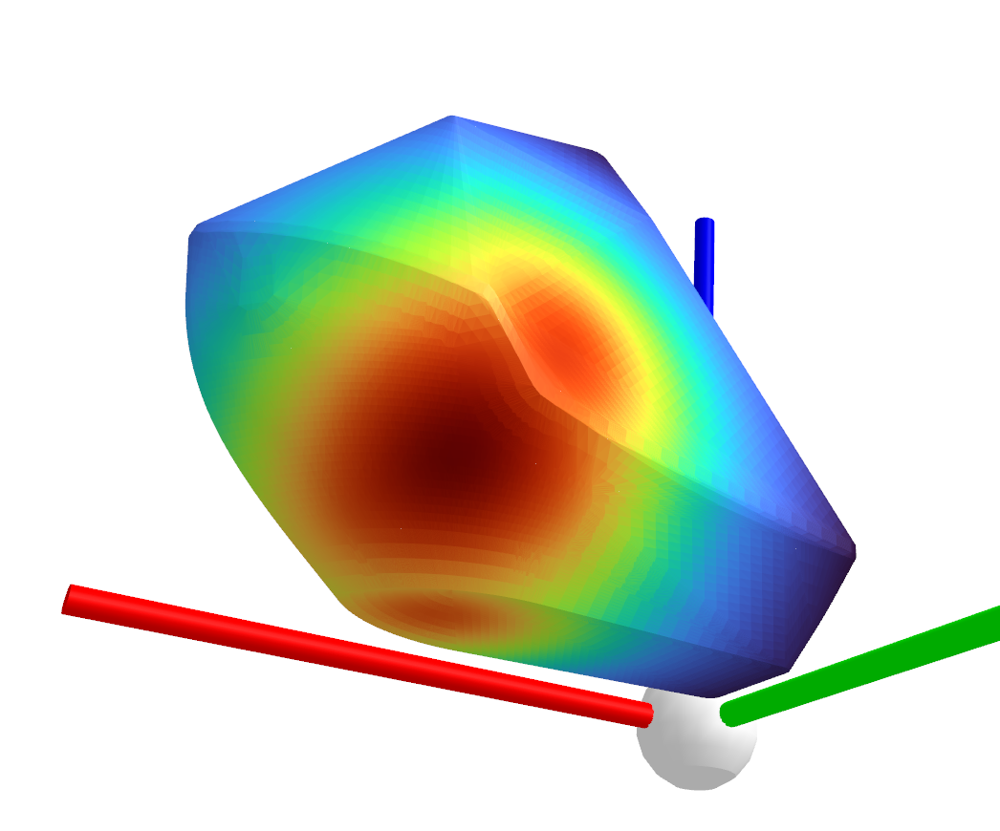
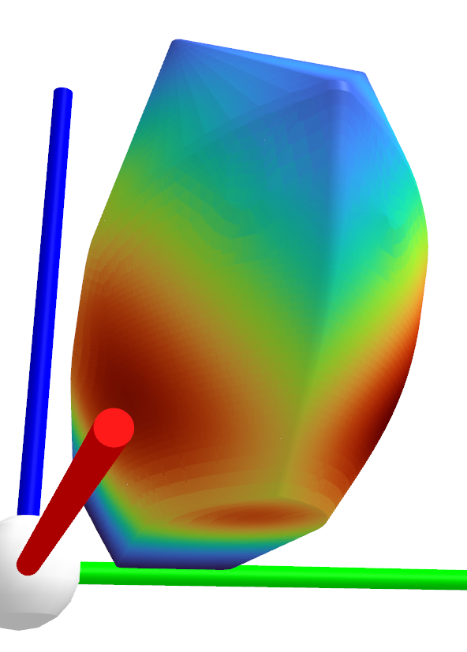
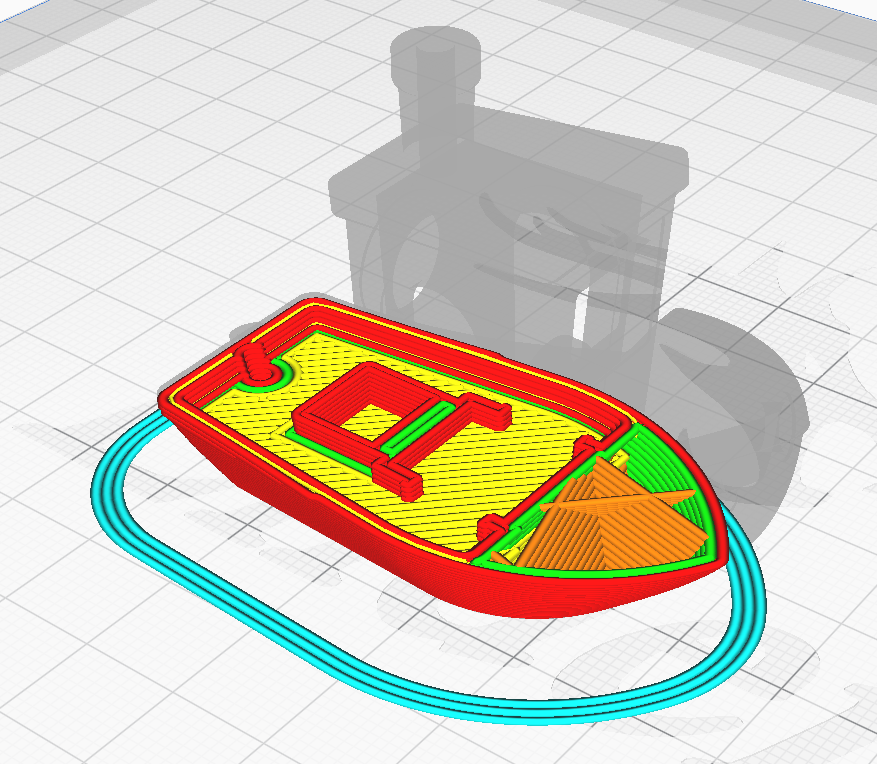

# gcode_com

The purpose of this script is to parse a `.gcode` file and find the Center of Mass of the printed object.
It has been tested with gcode generated by Cura 3.6 for an Ender-3 printer. But it should work with other Slicers and printers as well.

Why you may want to find the center of mass:
1. To check if 3d printed dice will be fair. The CoM should be to the center of the die.
2. To find where will you tie a string to an object, to hang it so it stays balanced.
3. To find if a rotating object will be balanced. eg. gears, clock hands etc.
4. To 3d print a balancing egg. That was my purpose.

This script:
1. Finds Center of Mass
2. Prints Axis Alligned Bounding Box dimensions and CoM coordinates relative to the center of AABB
3. Finds the object's Convex Hull
4. Draws Convex Hull, Center of the object's Bounding Box and Center of Mass
5. Draws G1 segments. Efficient only for small objects.
6. Draws Stability colormap on Convex Hull. We use CH because that should be of interest if we want to leave the object balance on a flat surface.


## Test with a Benchy
```
$ python3 gcode_com.py benchy.gcode 
- Reading "benchy.gcode"
- Processing 57554 gcode lines
- Calculating Center Of Mass
- Finding Convex Hull
-------------------------------------
Axis Aligned Bounding Box dimensions:
X: 58.96
Y: 30.00
Z: 47.50
-------------------------------------
CoM distances from AABB bounds:
X-: 34.24, X+: 24.72
Y-: 15.22, Y+: 14.79
Z-: 15.04, Z+: 32.46
```
As we see both by the numbers and the rendering, the CoM on this Benchy lies to the front and bottom of the boat, but it is also slightly moved to its left side.

So we could say that it will be more stable if laid on its side rather than standing (The darkest points exist on its left side).

However it is not really true that the darkest region indicates the more stable orientation. It just indicates the orientation that the model has the minimum Potential Energy. A dark region indicates a local minimum for the Potential Energy. Stability has to do with how easily this local minimum could be escaped, so it seems to be a more complex subject.




Indeed it seems that the cubic infill has placed more material to the left of the boat.



## Problems

- The actual material deposition may be different than what we calculate by checking the E values of the G1 commands.
- The object's bounding box is calculated by checking the gcode points. These points are offset to the interior of the object, during the slicing process, in order to maintain the real object's dimensions. So we expect the bounding box and CH to be slightly smaller than the printed object, smaller by:
  - nozzle_diameter along the horizontal directions
  - initial_layer_height at the bottom of the object
  - a value less than layer_height at the top of the object.
  
So let's say that we get an aproxiamtion for the CoM by ~1mm.

## Dependencies
- trimesh
- numpy
- matplotlib

Installing trimesh should also install numpy
```
pip install trimesh[easy]
pip install matplotlib
```